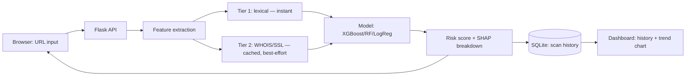

<div align="center">

# 🔐 Phishing URL Detection & Risk Analysis System

**An end-to-end ML system that classifies URLs as legitimate or phishing — tuned to catch attacks, not just score well on paper.**

[](https://www.python.org/)
[](https://flask.palletsprojects.com/)
[](https://scikit-learn.org/)
[](https://xgboost.readthedocs.io/)
[](https://www.docker.com/)
[](LICENSE)

</div>

<!--
  Replace this with a real screenshot of the dashboard before pushing —
  a visible screenshot is the single biggest thing that makes a README
  land. See the "Quick start" section for how to grab one.
-->
<p align="center"><em>📸 screenshot.png goes here</em></p>

---

## Why this exists

Most phishing-detection tutorials stop at "train a model, report accuracy." That's misleading for a security tool: **a missed phishing URL is far more costly than a false alarm on a legitimate one.** This project is built around that asymmetry from the ground up — feature engineering, model selection, and threshold tuning all optimize for **recall**, not accuracy.

It's also honest about its limits. The shipped dataset is synthetic (see [Training data](#training-data) below), and building it surfaced real generalization failures — a phishing URL that hid `paypal.co.uk` in the path of an unrelated domain slipped through as "legitimate" at first, and so did typosquats like `paypa1-secure.com`. Finding and fixing those gaps (typosquat detection, brand-impersonation checks, harder training examples) is documented in the code and is arguably the most useful part of this repo to read.

## Features

| | |
|---|---|
| 🎯 **Recall-first ML** | Logistic Regression / Random Forest / XGBoost compared on **F2-score**; decision threshold swept via the precision-recall curve to guarantee recall ≥ 0.95 |
| 🕵️ **Typosquat detection** | Catches lookalike domains via edit-distance + leetspeak normalization (`paypa1.com`, `micr0soft-support.net`, `gooogle.com`) |
| 🏷️ **Brand impersonation** | Flags a brand name appearing in a URL when the hostname doesn't actually belong to that brand |
| 🌐 **IDN homograph checks** | Detects punycode/non-ASCII domains used to visually spoof brands |
| 🔍 **SHAP explainability** | Every prediction shows *which features* moved the score, in which direction, and by how much — not just a black-box number |
| 📊 **Live dashboard** | URL input → risk score → reasons → scan history → time-series chart, no framework bloat |
| 🐳 **Docker-ready** | One `docker compose up --build` and it's running |
| 🔌 **Real-data ready** | `--phishing-csv` / `--legit-csv` flags swap the synthetic dataset for real PhishTank/OpenPhish + Tranco data with zero code changes |

## Architecture



## Quick start

### Local

```bash
pip install -r requirements.txt
python train_model.py        # trains the model, writes data/model.joblib
python app.py                 # dev server on http://localhost:5000
```

Open `http://localhost:5000`, paste a URL, hit **Check**.

> 📸 To grab a README screenshot: run a scan on something obviously phishy like `http://www.paypa1-secure.com/login`, screenshot the result panel, save it as `screenshot.png` in the repo root.

### Docker

```bash
docker compose up --build
```

Visit `http://localhost:5000`. The model trains at image-build time; the `data/` volume persists scan history and the model across restarts.

## Training data

Ships with a **programmatically generated demo dataset** (real legitimate domains + realistically-patterned synthetic phishing URLs) so it trains and runs fully offline — no external downloads needed. This is meant to prove out the full pipeline end-to-end, **not as a production-grade classifier**. Don't ship this exact model against real traffic without retraining on real data first.

To train on real data instead:

```bash
python train_model.py --phishing-csv data/real_phishing.csv --legit-csv data/real_tranco.csv
```

| Flag | Source | Format |
|---|---|---|
| `--phishing-csv` | [PhishTank](https://phishtank.org/) or [OpenPhish](https://openphish.com/) | CSV with a `url` column, or one URL per line |
| `--legit-csv` | [Tranco](https://tranco-list.eu/) top sites | `rank,domain` CSV, no header |

The hand-crafted "hard" examples (typosquats, brand-in-path phishing, real-brand login pages, brand mentions on news sites) are layered on top of whichever base dataset you choose, since they target specific weaknesses this project has already hit in testing — independent of where the bulk data comes from.

## How recall is prioritized

1. **Class weighting in training** — `class_weight="balanced"` (Logistic Regression / Random Forest) or `scale_pos_weight` (XGBoost), so the model itself leans toward catching phishing rather than relying on the threshold alone.
2. **Model selection by F2-score** — recall weighted 2× precision when picking the winner among the three candidates.
3. **Threshold tuning via the precision-recall curve** — swept to the lowest threshold that still holds recall ≥ 0.95 on the held-out test set. This tuned threshold (not 0.5) is what `app.py` uses at inference time, and is reported by `/api/v1/health`.
4. **Deterministic overrides for near-zero-false-positive signals** — a typosquatted domain or a raw IP host forces a phishing verdict regardless of what the model alone scores, since no legitimate business genuinely operates on `paypa1.com` or a bare IP.

## Explainability

Two layers, shown together in the dashboard:

- **Rule-based reasons** — plain statements like *"Domain closely resembles brand 'paypal' (character substitution)"*. Always available, doesn't need the model.
- **SHAP feature contributions** — the top 5 features that moved *this specific prediction*, with direction and relative magnitude, via `shap.TreeExplainer` (RF/XGBoost) or `shap.LinearExplainer` (Logistic Regression). Adds ~50–70ms per scan; degrades gracefully to `[]` if SHAP fails.

## API

| Method | Endpoint | Purpose |
|---|---|---|
| `POST` | `/api/v1/scan` | `{"url": "...", "deep_scan": true}` → prediction, risk score, reasons, SHAP breakdown |
| `GET` | `/api/v1/scans?limit=25` | Recent scan history |
| `GET` | `/api/v1/stats/timeseries` | Daily phishing/legitimate counts |
| `POST` | `/api/v1/feedback` | `{"scan_id": 1, "user_label": "phishing"}` — user correction, saved for future retraining |
| `GET` | `/api/v1/health` | Active model name + decision threshold |

## Project structure

```
phishing-detector/
├── features.py          # Tier-1 (lexical) + Tier-2 (WHOIS/SSL) feature extraction
├── train_model.py        # dataset build, model comparison, threshold tuning
├── app.py                 # Flask API + dashboard server
├── templates/index.html   # dashboard UI (no framework, IBM Plex Sans/Mono)
├── Dockerfile / docker-compose.yml
├── requirements.txt
└── data/                  # generated: model.joblib, scans.db (gitignored)
```

## Notes on sandboxed/offline environments

`extract_tier2_features()` (WHOIS domain age, live SSL check) needs outbound access to arbitrary hosts. If that's unavailable (firewalled server, CI, etc.) it fails gracefully to neutral values rather than crashing the request. Toggle "deep scan" off in the UI, or pass `"deep_scan": false` to `/api/v1/scan`, to skip these lookups and rely on Tier-1 features only.

## Roadmap

- [ ] Feedback-driven retraining — fold `/api/v1/feedback` corrections into a scheduled retrain
- [ ] Live reputation signal (Google Safe Browsing) as a corroborating check
- [ ] Postgres/MySQL for multi-instance deployment
- [ ] Rate limiting + auth for public deployment
- [ ] Regression test suite (fixed set of known phishing/legitimate URLs)

## License

[MIT](LICENSE)
